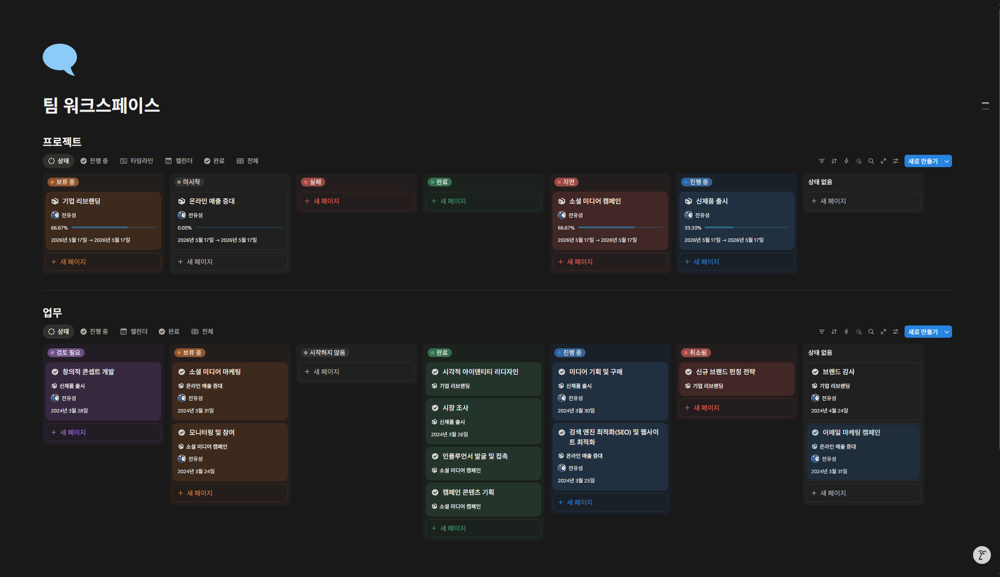
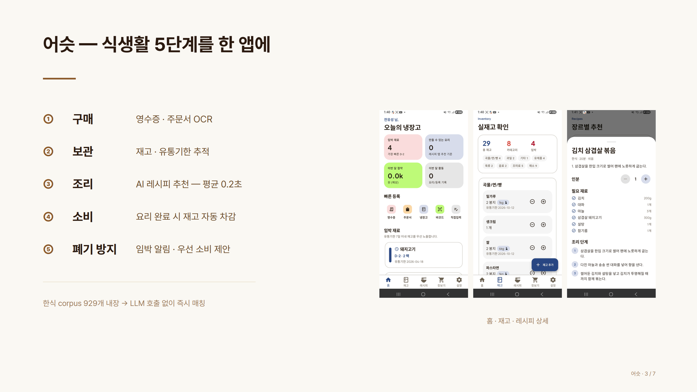

# AI 실무 세미나

## 1. 기대 효과

- **AI-native 흐름 이해**: 단발성 ChatGPT 사용을 넘어, 모델·도구·에이전트가 결합되어 실제 작업을 처리하는 방식에 대한 본질 수준의 감각 형성.
- **인공지능 활용 능력 함양**: 학생 본인의 진로 영역(전략·마케팅·재무·생산·창업)에 AI를 꽂아 보는 경험을 통해, 강의 종료 후에도 새 도구를 스스로 평가·통합하는 능력 확보.

---

## 2. 커리큘럼

| 축 | 목표 | 청중이 얻는 것 |
|---|---|---|
| **A. 실무 즉시 적용** | 도구를 손에 쥐어 줌 | "업무·과제에 쓸 것" |
| **B. 메타 역량** | 새 도구를 스스로 평가·통합할 수 있는 사람 | "1년 후에도 안 낡는 사고 프레임워크" |

도구는 금방 노후화. **두 축을 같이 다루어** 실용성·지속력 동시 확보.

### A. 실무 즉시 적용

| 모듈 | 내용 |
|---|---|
| **A1. Office 문서를 AI로 만들기: Word·Excel·PPT 라이브** | 같은 자료(예: 시장조사 노트)로 Word 보고서 / Excel 표·차트 / PPT 슬라이드를 두 경로로 라이브 제작. **경로 ① Claude for Office (Microsoft Marketplace add-in)**: Office 365 안에서 바로 호출. **경로 ② Claude Code Skills**: `/pdf` 등 스킬로 결과를 터미널에서 생성. 두 경로의 사용 장단점 비교. |
| **A2. 일상 도구 묶음: Slack·Notion + 웹 LLM vs 설치형 에이전트** | Slack·Notion 기초 + AI 통합 (Notion AI, Slack에서 Claude 호출). **웹에서 쓰는 ChatGPT·Claude 웹·Gemini**: 채팅창에 질문, 파일 첨부, 이미지 생성 등 단발 작업 중심. **컴퓨터에 설치하는 에이전트, Claude Code·Codex CLI·Claude 데스크탑 앱**: 내 폴더의 파일을 직접 읽고·쓰고·실행. 다단계 작업을 스스로 계획하고 도구를 호출하며 진행. 같은 질문(예: "이 폴더 정리해줘")을 웹 챗봇과 에이전트에 각각 던져 두 결과의 차이 라이브 비교. 인문계 학생이 "언제 웹, 언제 에이전트를 쓰는지" 감각 형성. |

### B. 메타 역량

| 모듈 | 내용 |
|---|---|
| **B1. LLM 작동 원리** | 토큰(platform.openai.com/tokenizer), 확률적 생성, 컨텍스트 윈도우, 3가지 본질. "왜 AI가 자신 있게 거짓말하는가" / "왜 같은 질문에 다른 답이 오는가" / "왜 긴 대화 중간에 까먹는가" 직관 형성. |
| **B2. 영역별 AI 활용 케이스** | 경영학 4영역(전략·마케팅·재무·생산) 매핑. 그중 1개(마케팅)를 시연. 나머지 영역은 1~2줄 소개. |
| **B3. 프롬프트 엔지니어링** | QUE 질문 템플릿 소개. 막 던지기 vs 체계적인 질문 차이 비교. |
| **B4. 컨텍스트 엔지니어링** | "프롬프트보다 컨텍스트가 본질". 파일 첨부·메모리·CLAUDE.md 패턴. |
| **B5. 하네스 엔지니어링 + 에이전트** | LLM + 도구 + 루프 = 에이전트. Claude Code 라이브 데모. |
| **B6. Git·GitHub: 왜 인문계도 알아야 하나** | 포트폴리오·이력서 관점에서 GitHub의 의미. 1분 정리 + 라이브로 결과물 push까지. |

---

## 3. 샘플 산출물

### 샘플 노션 페이지 · 팀 워크스페이스

### 샘플 발표자료

